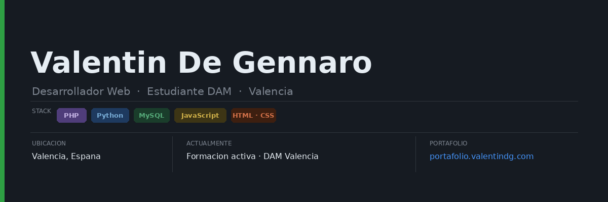

  

<h1 align="center">👋 Hola, soy Valentin Antonio De Gennaro</h1>

<h3 align="center">🎓 Estudiante de DAM en CEACFP Valencia

---

## Lenguajes

          

---

## Estadísticas de GitHub

  
  

---

